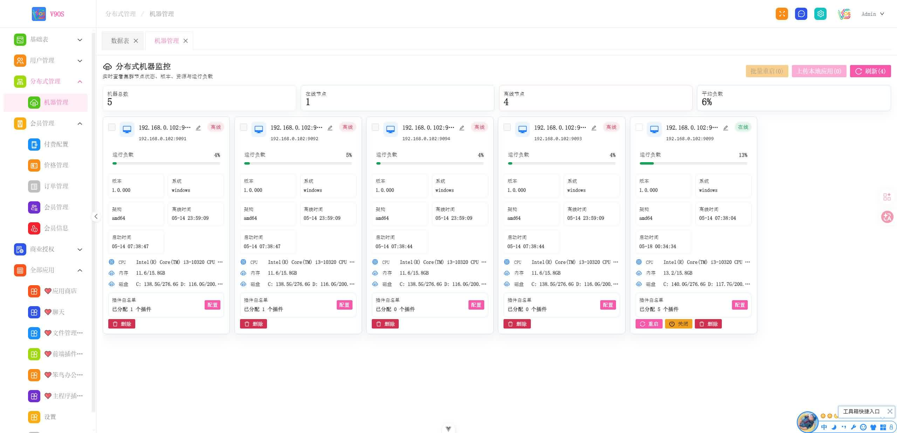
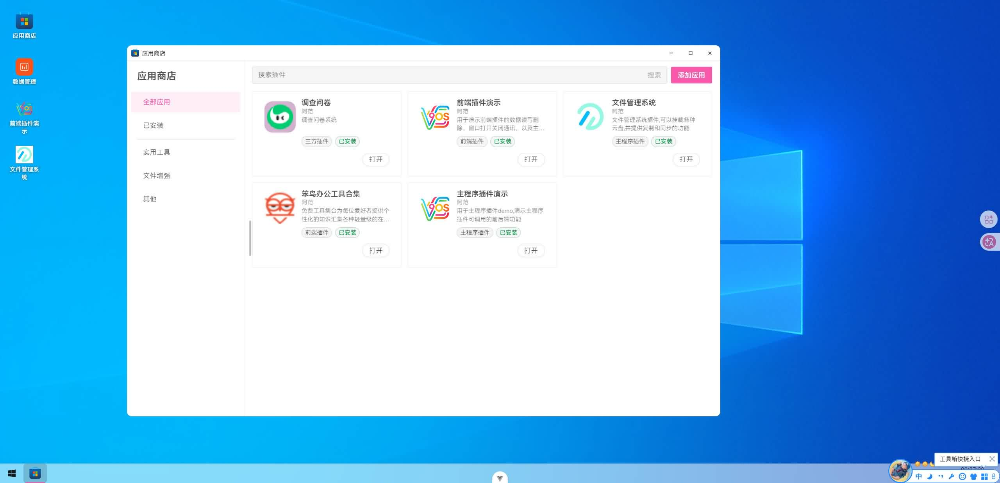
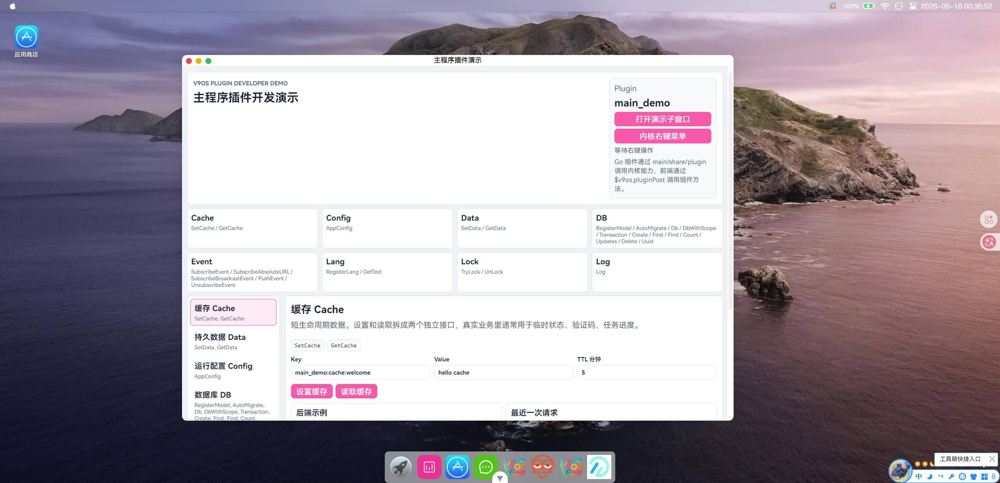
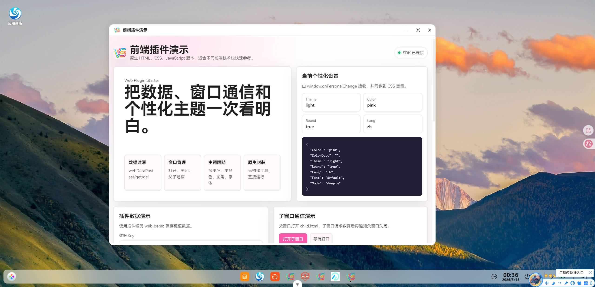

<p align="center">
  <strong>一个现代化的跨平台后端管理框架，融合分布式系统的强大功能与单体应用的简洁性。</strong>
</p>

<p align="center">
  <a href="https://golang.org/doc"></a>
  <a href="https://nodejs.org"></a>
  <a href="https://opensource.org/license/apache-2.0"></a>
  <a href="https://v3.vuejs.org"></a>
</p>

<p align="center">
  <a href="#-核心特性">特性</a> •
  <a href="#-技术架构">技术架构</a> •
  <a href="#-功能模块">功能模块</a> •
  <a href="#-快速开始">快速开始</a> •
  <a href="#-贡献指南">贡献</a> •
  <a href="#-许可证">许可证</a>
</p>

## ✨ 核心特性

V9OS 是专为现代云原生与分布式环境设计的后端管理系统，采用 Go Gin 后端和 Vue3 前端构建。其独创的 **"分布式单体"** 架构使开发者能够使用一套代码库，无需复杂修改即可灵活部署为高性能单体应用或弹性分布式系统，显著降低了开发与运维的复杂度。

| 特性                  | 描述                                                                      |
| :-------------------- | :------------------------------------------------------------------------ |
| **🏗️ 分布式单体架构** | 一套代码无缝适配单体部署与分布式微服务部署，降低开发与运维复杂度。        |
| **🤖 智能代码生成器** | 支持零代码生成新增/编辑/详情/删除/批量删除/导入/导出/分页查询等全套常见业务功能。|
| **🔌 分布式插件系统** | 支持高度可扩展的分布式插件，实现热插拔与动态加载功能模块。                |
| **💾 混合缓存策略**   | 同时支持本地内存缓存与 Redis 分布式缓存，智能缓存切换与降级策略。         |
| **📨 多消息队列**     | 统一接口支持本地内存队列与 RocketMQ 等分布式消息队列，保证消息可靠性。    |
| **🗄️ 多数据库支持**   | 从内嵌 SQLite 到云数据库（MySQL/PostgreSQL/...），提供统一 ORM 操作接口。 |
| **🏷️ 数据软删除**     | 内置数据软删除支持，保障数据安全与可恢复性，避免误操作。                  |
| **⚡ 智能缓存防击穿** | 集成高级缓存机制，有效防止缓存击穿与缓存穿透，提升系统稳定性。            |
| **📊 多日志输出**     | 同时支持本地文件、控制台输出和数据库存储日志，便于跟踪与审计。            |
| **🎨 双编译模式**     | 同时支持有界面编译和无界面（Headless）编译，适应不同部署环境。            |
| **💫 现代化前端**     | 基于 Vue3 和 NativeUI 组件库，提供美观且功能丰富的用户界面。              |
| **🌍 多系统外观**     | 支持Backend、Win10、macOS、Deepin、Pad 系统外观效果，提供原生体验。                  |
| **🌈 主题与样式**     | 支持浅色/深色主题、多种主题色、圆角/方角切换及字体切换，适应不同偏好。    |
| **🌐 多语言支持**     | 前后端全面支持国际化（i18n），轻松适配多种语言环境。                      |

## 设计理念

V9OS 不想只做一个后台模板，而是希望提供一套可以长期使用、持续扩展的业务底座。

在项目早期，它可以用文件数据库、文件缓存、文件消息队列快速启动，尽量减少环境依赖；当业务进入稳定阶段，可以切换到单机数据库、缓存和消息队列；如果规模继续增长，也可以继续演进到读写分离、缓存集群和消息队列集群。

业务扩展同样是 V9OS 重点考虑的方向。主程序插件、前端插件、第三方插件和远程应用可以在同一套系统中共存，新增功能不必全部堆进主工程，已有系统也可以逐步接入。

V9OS 也希望后台不只是“可用”，而是适合长期使用。多套外观、字体、圆角、透明度、主题色和多语言能力，让系统可以根据团队、客户或产品定位调整成不同的使用体验。

更多适用方向见 [V9OS 应用场景](docs/application-scenarios.md)。

#### 效果图
###### 分布式管理

###### 应用商店

###### 主程序插件demo

###### 前端插件demo


## 🏗️ 技术架构

V9OS 采用分层架构设计，确保系统的可扩展性、可维护性和高性能。

### 开发目录结构

```
├── api/                     # 后端项目
│   ├── cmd                  # 启动入口目录
│   │   ├── console          # 控制台启动入口
│   │   ├── gui              # 带UI的启动入口
│   ├── internal             # 核心内部目录
│   │   ├── app              # 带UI的启动包
│   │   ├── cache            # 缓存模块
│   │   ├── config           # 配置模块
│   │   ├── controller       # 控制器模块
│   │   ├── database         # 数据库模块
│   │   ├── fuse             # 引火线包
│   │   ├── inface           # 扩展模块
│   │   ├── ioc              # IOC容器模块
│   │   ├── logger           # 日志模块
│   │   ├── middleware       # 中间件模块
│   │   ├── model            # 模型模块
│   │   ├── plugin           # 插件管理模块
│   │   ├── queue            # 队列模块
│   │   ├── server           # 不带UI的启动包
│   │   └── store            # 数据源扩展包
│   └── pkg                  # 工具包
├── share                    # 插件共享包
├── util                     # 工具项目
│   ├── build.go             # 编译工具
│   └── template             # 代码生成器
├── web                      # 前端项目
│   ├── public               # 静态文件
│   └── src                  # 核心源码
```

### 运行目录结构

```
启动目录/
├── v9os.exe                 # 内核主程序
├── init.json                # 初始化配置文件
├── fonts/                   # 字体目录
│   ├── xxxx.font            # 字体文件
├── plugins/                 # 插件目录
│   └── main/                # 后端插件目录
│       └── xxxx/
│           └── xxxx.exe     # 后端插件可执行文件
│   └── web/                 # 前端插件目录
│       └── xxxx/
│           └── index.html   # 前端插件入口
│   └── third/               # 三方插件目录
│       └── xxxx/
│           └── index.html   # 三方插件前端入口地址
│           └── restart.bat  # 三方插件重启脚本（Windows）
│           └── restart.sh   # 三方插件重启脚本（Linux/macOS）
│           └── stop.bat     # 三方插件停止脚本（Windows）
│           └── stop.sh      # 三方插件停止脚本（Linux/macOS）
└── config/                  # 本地配置目录
```

### 访问路径
*   **主程序访问路径**: `http://127.0.0.1:9099`
*   **主程序插件访问路径**: `http://127.0.0.1:9099/page/xxxx/`
*   **前端插件访问路径**: `http://127.0.0.1:9099/api/webplugin/xxxx/`
*   **三方插件访问路径**: `http://127.0.0.1:9099/api/thirdplugin/xxxx/`
*   **远程应用访问路径**: `云站点地址`

### 后端技术栈
*   **框架**: Go Gin Web 框架
*   **缓存**: 本地缓存 + Redis
*   **消息队列**: 本地队列 + RocketMQ
*   **数据库**: SQLite + MySQL/PostgreSQL/SqlServer/GaussDB/ClickHouse
*   **ORM**: GORM（支持软删除与缓存）

### 前端技术栈
*   **框架**: Vue 3.5.18
*   **UI组件**: NativeUI 2.42.0
*   **外观**: 支持多系统外观（Win10/macOS/Deepin/Backend/Pad）
*   **主题与样式**: 浅色/深色主题、多种主题色、圆角/方角及字体切换
*   **国际化**: 多语言支持（i18n）

## 🏷️ 功能模块
### 开源社区版
*   **个人中心**: 修改图像/昵称/密码
*   **个性化**: 切换外观/颜色/语言/主题/圆角/字体/壁纸
*   **系统设置**: 网站标题/副标题/Logo/默认密码/默认语言/默认外观/默认主题/默认颜色/默认字体/默认圆角/哀悼模式/默认壁纸/备案信息/安全入口
*   **配置设置**: 服务器/日志/跨域/限流/分布式/认证/数据库/缓存/消息队列配置
*   **多桌面UI**: 后台管理/仿Win10/仿Macos/仿Deepin/仿Pad
*   **消息通知**: 给用户发送实时通知
*   **应用商店**: 海量应用(即将打造,插件是V9OS扩展的核心方向)
### 企业版
*   **多用户系统**: 角色管理/部门管理/功能权限/数据权限/好友聊天/群聊/企业聊/短信/邮件/注册配置/三方登陆
*   **分布式系统**: 机器管理/批量重启/插件负载设置(插件白名单)/本地应用上传/机器升级
*   **会员管理系统**: 微信支付/支付宝支付/三方支付/会员价格管理/订单管理/会员列表


## 🚀 快速开始

### 前置条件
确保您的开发环境满足以下要求：
*   Go 1.24.6 或更高版本
*   Node.js 22.19.0 或更高版本
*   （可选）Mysql服务器（如需使用Mysql数据库）
*   （可选）Redis服务器（如需使用Redis缓存）
*   （可选）RocketMQ（如需使用分布式消息队列）

### 安装与运行
遵循以下步骤即可快速搭建 V9OS 开发环境：

1.  **克隆仓库**
    ```bash
    git clone https://github.com/fs185085781/v9os.git
    cd v9os
    ```

2.  **运行后端服务**
    ```bash
    cd web
    npm i
    npm run build
    cd ..
    ```
    为了让Go进行对前端合体,以上代码仅首次才需要运行

    ```bash
    cd api
    go mod tidy
    go run cmd/console/main.go
    ```

3.  **运行前端服务**
    ```bash
    cd web
    npm install
    npm run dev
    ```
4.  **访问**
    ```bash
    浏览器访问 http://127.0.0.1:9098
    开发模式下:前端端口9098,后端端口9099
    帐号admin  密码123456
    ```

5.  **编译合体（可选）**
    ```bash
    cd util
    go run build.go
    ```

6.  **运行合体后的程序（可选）**
    *   **Windows**: 双击合体包目录中的 `v9os.exe` 运行。
    *   **Linux**:
        ```bash
        chmod +x v9os # 赋予执行权限
        ./v9os
        ```
7.  **访问（可选）**
    ```bash
    浏览器访问 http://127.0.0.1:9099
    成品模式下:前后端合并,端口9099
    帐号admin  密码123456
    ```
    更多开发教程请查看 [开发使用教程](docs/starts.md)。


## 🤝 贡献指南

我们欢迎并感谢任何形式的贡献！

### 贡献流程
1.  Fork 本项目至您的 GitHub 账户。
2.  创建您的特性分支 (`git checkout -b feature/AmazingFeature`)。
3.  提交您的更改 (`git commit -m 'Add some AmazingFeature'`)。
4.  将分支推送到远程仓库 (`git push origin feature/AmazingFeature`)。
5.  提交 Pull Request 到本项目的 `main` 分支。

### 代码与提交规范
请确保您的代码遵循：
*   项目约定的 Go 和 JavaScript 代码规范。
*   包含适当的单元测试与集成测试。
*   更新或补充相关文档，包括 README、API 文档等。

## 📄 许可证

本项目采用 Apache 2.0 许可证。查看 [LICENSE](LICENSE) 文件了解详情。

## 👥 作者

### 阿范 🎈
*   Email: 185085781@qq.com
*   GitHub: [fs185085781](https://github.com/fs185085781)
*   Blog: [https://www.tenfell.cn](https://www.tenfell.cn)

## 🙏 致谢

感谢所有让本项目变得更好的开发者们！特别感谢：
*   Go 语言社区
*   Vue.js 社区
*   Gin Web 框架团队
*   NativeUI 组件库作者

## ⭐ 支持项目

如果 V9OS 对您有帮助，或您认可我们的工作，请给我们一个 Star！您的支持是我们持续发展的动力。
